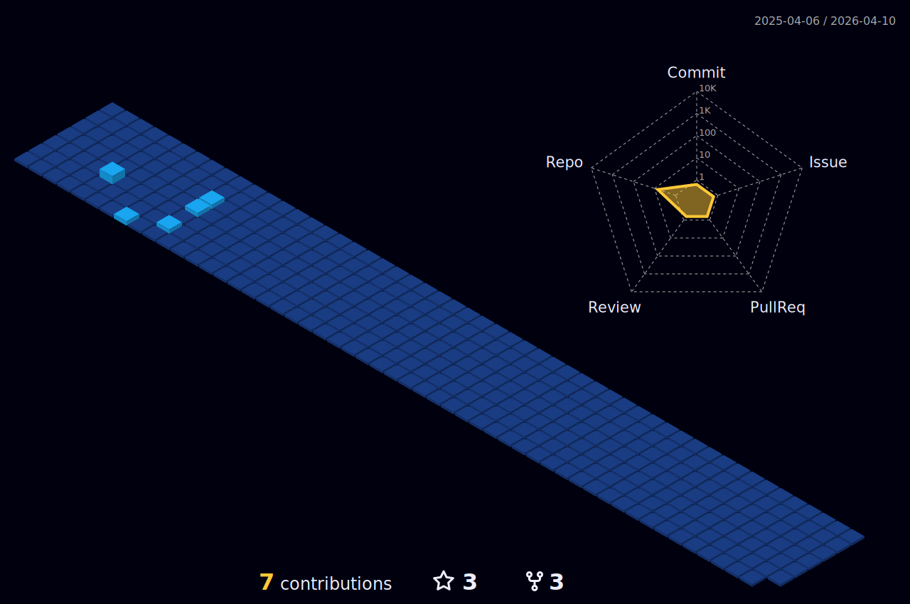

- 👋 Hi, I’m Naan.
- 💞️ I’m looking to collaborate on innovative projects aimed at solving/simplifying problems in our society.
- 📫 naanahmed24@gmail.com and @nbjrr on Telegram.
- 💞️ Message me on LinkedIn(https://www.linkedin.com/in/naanahmed) if you are a clean code enthusiast and looking to build your portfolio.

<!---
naanahmed/naanahmed is a ✨ special ✨ repository because its `README.md` (this file) appears on your GitHub profile.
You can click the Preview link to take a look at your changes. 
--->

<p align="center">
 


</p>

 [](https://github.com/anuraghazra/github-readme-stats)

[](https://git.io/streak-stats)

<!--START_SECTION:waka-->

```txt
From: 11 September 2022 - To: 29 August 2024

Total Time: 1,114 hrs 33 mins

JavaScript                 629 hrs 10 mins >>>>>>>>>>>>>>-----------   56.45 %
CSS                        138 hrs 43 mins >>>----------------------   12.45 %
Ruby                       82 hrs 30 mins  >>-----------------------   07.40 %
HTML                       56 hrs 55 mins  >------------------------   05.11 %
Python                     41 hrs 7 mins   >------------------------   03.69 %
```

<!--END_SECTION:waka-->

<!--    -->


